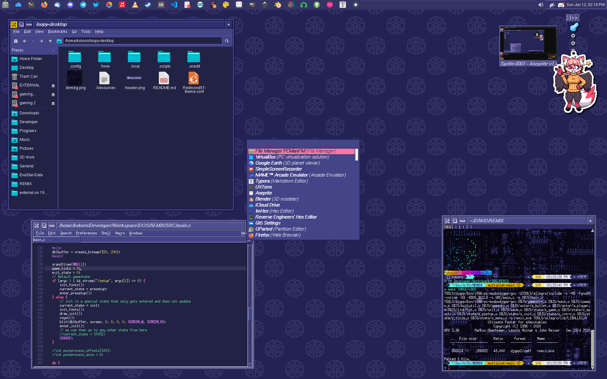

# 

**Long intro:** loopy-desktop is a comprehensive IRIX-like, dark-purple-with-pink-and-cyan-accents desktop theme for fvwm3 and more. Its name comes from the [Casio Loopy game console](https://en.wikipedia.org/wiki/Casio_Loopy), of which the color scheme also came from.

**Short intro:** These are my dotfiles.

Please read through this entire README before applying parts of the theme. Issues clearly opened without reading through it beforehand will be closed.

## Recommended Programs

Feel free to use alternatives, but keep in mind not all programs will use the standard GTK/Qt themes and require manual theming. If you make a theme for a program not covered by loopy-desktop, feel free to make a PR.

- Window manger: fvwm3 (see notes)
- Terminal: rxvt-unicode
- Shell: fish (see notes)
- Dock/Panel: xfce4-panel (I use the docklike plugin)
- Launcher: rofi
- Notifications: dunst
- File manager: PCManFM or Thunar
- Text editor: XNEdit
- Applying themes: lxappearance and qt5ct

## Install Notes

### FVWM

loopy-desktop practically revolves around fvwm3; if you want to use a different window manager, your window decorations will not look correct after applying the GTK/Qt themes. Most distros package fvwm2 as just 'fvwm', so make sure to specify 'fvwm3' or check the version of 'fvwm' in your package manager before installing. Distributions such as Debian don't package fvwm3 (*yet!*), so in that case you'll need to install it manually from the [releases](https://github.com/fvwmorg/fvwm3/releases). [More details on that](https://github.com/fvwmorg/fvwm3/blob/master/dev-docs/INSTALL.md); take note of the section titled "Installing From Release Tarball".

The config included here is the one I use on a daily basis, so you might want to change a few things.

- Nearly all virtual desktop features have been removed; if it's something you rely on, you'll need to add it all back in by comparing with fvwm's default config.
- Some of the Platinum sound effects from MacOS have been added, and require mpg123 to be played. If you hate the idea of sound effects, comment out the following:
  - In StartFunction, `+ I Module FvwmEvent EventSounds`
  - In RaiseMoveX, `+ M PlaySound windowMoveDone.mp3`
  - In Thumbnail, `+ I PlaySound windowClose.mp3`
- EwmhBaseStruts defines what space is avoided when creating new windows or maximizing them. In my case, I have 30 pixels at the top of my primary monitor (`DVI-D-0`) reserved for xfce4-panel. You will definitely need to change this; If you have a single screen, remove the `screen DVI-D-0` portion entirely. If you have multiple monitors, use `xrandr -q` to list your display names, find your preferred monitor, and replace `DVI-D-0` with that.
- The locking mechanism in `onLock.sh` and `onSuspend.sh` assumes you have [xsecurelock+xss-lock installed and configured properly](https://github.com/google/xsecurelock). In my case, xss-lock handles locking before suspend via `~/.Xsession`. You'll want to edit these scripts, either to switch the screen locker entirely, or to tweak the appearance of XSL.

Some notes on shortcuts:

- Since screen-edge-resizing (I refuse to call it "Aero Snap", okay?) isn't really a thing in FVWM, I've set up a sort-of tiling system via the arrow keys/keypad. All shortcuts will toggle between the desired shape and the window's original shape.
  - Super+Left/Right or Keypad4/6: Left/right sides
  - Super+Up or Keypad5: Maximize
  - Super+Down: Upper-left corner (for those without a keypad)
  - Super+Keypad8/2: Upper/lower
  - Super+Keypad7/9/1/3: Corners
- Super+Space will open rofi as an application launcher.
- Do mouse bindings count as shortcuts? Here are some useful ones:
  - Double-click titlebars to maximize/restore
  - Right-click titlebars to shade
  - Middle-click+drag window borders to move them

Installation for the fvwm config is simple; remove `.fvwm` from your home directory, then copy `.fvwm` from the repository to your home.

### Qt

This covers almost every Qt-based program under the sun, including the KDE ones such as Kdenlive and Krita. It comes in two parts: a qt5ct theme, and a KDE color scheme. Place `.config/qt5ct/colors/Loopy.conf` and `.local/share/color-schemes/Loopy.colors` into their respective locations in your home directory, creating the directories as necessary if they don't exist. Use qt5ct to set the style to "Windows", and the palette to "Custom", selecting "Loopy" in the dropdown. You should also set your fonts and icon theme here (see the notes on those in the "Not Included" section).

Some Qt-based programs won't have the theme applied right away. You'll need to look around in the settings for a theme option, and select "qt5ct" there. Apps like Kdenlive and Krita won't get the colors from qt5ct, and that's where the .colors file comes in; listed along with Breeze, Breeze Dark, etc. will be the Loopy colorset.

### rxvt-unicode

Copy `.Xresources`, `.termBG.png`, and `.urxvt` over to your home directory. Run `xrdb ~/.Xresources` to apply.

### XNEdit

[XNEdit](https://github.com/unixwork/xnedit) is a somewhat-modern fork of NEdit. To apply the theme, copy `.Xresources` and `.xnedit` to your home directory. Run `xrdb ~/.Xresources` to apply, if you haven't already.

### Fish

I actually don't know why I made this a part of loopy-desktop. I guess I was anticipating people asking for my shell setup?

Anyway, you'll need Fish along with the [Tide](https://github.com/IlanCosman/tide) prompt. Copy the contents of `.config/fish` over once you're done installing that. You'll also need to copy over `.scripts` to your home directory for the MOTD and weather scripts; add a cronjob to run `weather.sh` every hour.

If you don't want to switch over to Fish and are currently using Zsh, check out [powerlevel10k](https://github.com/romkatv/powerlevel10k). Although it's a bit... *much*, you should be able to configure the prompt to look like the one in the screenshot.

### Rofi

Self explanatory; copy `.config/rofi/config.rasi` where it belongs.

## Not Included

Some components of the theme couldn't be included here for one reason or another.

### GTK

loopy-desktop uses a modified version of the [Redmond97 theme](https://github.com/matthewmx86/Redmond97). You'll need to do the following in order to install it:

1. Install imagemagick.
2. Clone the [Redmond97 repository](https://github.com/matthewmx86/Redmond97) locally.
3. In Extras/Theme_Builder/base.tar.gz, edit /gtk-3.0/settings.ini, remove the line starting with `gtk-icon-theme-name`. In /index.theme, remove the line starting with `IconTheme=`.
4. In Extras/Theme_Builder, delete theme.conf and replace it with the one in this repository, renaming as necessary.
5. In the same directory, run `gen_theme.sh`. Use lxappearance to set the theme.

**Note:** Many applications won't look correct until you install gdk2-engines-pixbuf, or your distro's equivalent package.

### Fonts

You *technically* already have all of the fonts needed, provided you have xfonts-base and xfonts-75dpi installed (with the exception of HCP Maru Gothic, which I used for xsecurelock). There's a bit more setup involved to get them available to most applications, though;

- Remove `/etc/fonts/conf.d/70-no-bitmaps.conf`, or whatever the equivalent is in your distro.
- Use fontforge to convert the following fonts to .otb. Save them somewhere in your home directory.
  - `/usr/share/fonts/X11/75dpi/helvR12.pcf.gz`, `/usr/share/fonts/X11/75dpi/helvR14.pcf.gz`
    - You could do the rest of the sizes, but I've found these two work well enough for most cases.
  - `/usr/share/fonts/X11/misc/6x13.pcf.gz`
  - `/usr/share/fonts/X11/misc/8x16.pcf.gz`
    - You can skip this one if you want; provides a slightly bigger monospace font
  - `/usr/share/fonts/X11/misc/10x20.pcf.gz`
    - You can skip this one if you want; provides an even larger monospace font
- Move the .otb files you've just created to the appropriate locations. For example, `helvR12.otb` would go in `/usr/share/fonts/X11/75dpi`, and `6x13.otb` would go in `/usr/share/fonts/X11/misc`.
- Run `sudo fc-cache -fv`

**Note:** You can also batch convert every font containing 'helv' with some very light bash/fontforge scripting. This'll give you many more options for font sizes, but it isn't required. Same goes for a lot of the X11 misc fixed fonts, but you may need to do those one at a time (otherwise you'll end up with *a lot* of symbol fonts). In the future, I may add a small helper script to complete this step.

Then use lxappearance to set the font to "Helvetica Medium 9", and qt5ct to set the general font to the same. qt5ct also has a setting for the fixed width font; set that to "Fixed", with whatever size you'd like (based on which fixed width fonts you ended up converting).

Though the system generally uses the bitmap fonts in places that make sense, there's sometimes a bit of leakage; for example, web browsers will continue to render pages as intended with proper font anti-aliasing, but will disable it for text that's to be rendered with Helvetica. It's not that big of a problem though, as web designers seem to be getting tired of it. If you *do* want Firefox to use bitmap fonts in pages, check Settings for the "Fonts" subheading, and click "Advanced...". There you can set your sans-serif font to Helvetica, and your monospace font to Fixed. (One of the fonts in X11's misc fonts provides Times, so you can use that for the serif font once you've converted it to otb.)

### Firefox

[Theme available here.](https://addons.mozilla.org/en-US/firefox/addon/loopy/)

### VSCode

[Theme available here.](https://marketplace.visualstudio.com/items?itemName=kokoscript.loopytheme)

### Icons

There is no specific icon theme associated with loopy-desktop. I recommend using the [Papirus icon theme](https://github.com/PapirusDevelopmentTeam/papirus-icon-theme) since it has somewhat-vibrant colors that work well with the purple, but realistically any theme should work.

If you end up using Papirus, use the `papirus-folders` tool and play around with the colors; either cyan or pink should work best.

(*Sidenote: I originally wanted to create an IRIX-like icon theme to go along with loopy-desktop, but realized it would take far too much of my time- even with scripts to practically make the theme for me- so I've shelved it for now. Once I do create it, if at all, it'll be added.*)

### Cursors

To revert to the basic X11 cursors, edit `~/.icons/default/index.theme`, clearing out the value after `Inherits=`. Do the same with `~/.config/gtk-3.0/settings.ini`, but with the `gtk-cursor-theme-name` variable. You'll need to do this *after* you've finished using lxappearance, otherwise the cursors will be reset to the system default.

In the case that the basic X11 cursors *still* don't show up, edit the .theme files in `/etc/X11/cursors`, clearing the value of `Inherits` for each as before.

## That's it!

If you have any suggestions or problems (**after reading everything here**), feel free to open an issue. If you have any *improvements*, feel free to open a PR. Comments can be left anywhere that isn't the issues page. Please.

### ...but I'm on Windows! :(

Hope you're on Windows XP or earlier, because [this is all I've got](https://kokoscript.com/depot/themes/kokoscript-loopy.Theme).

### ...but I'm on (Classic) MacOS! :\(

I swear I have a version of loopy for Kaleidoscope ready to go, I've just never posted it anywhere lol

### ...but I'm on Haiku! :\(

[Loopy for Haiku!](https://github.com/kokoscript/loopy-haiku)
